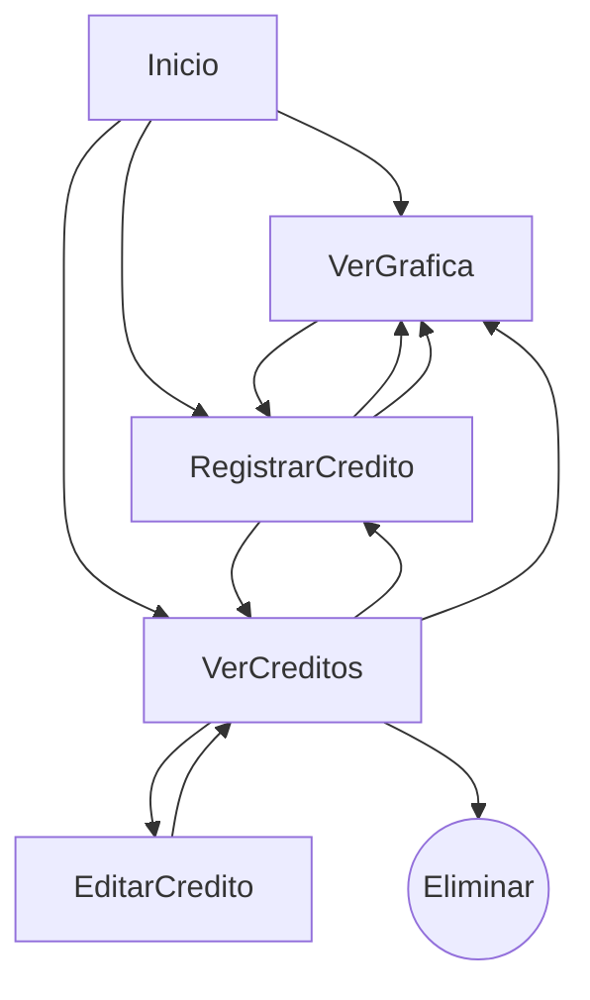

# Seguimiento de créditos

**Examen Práctico: Desarrollo de una Herramienta de Registro de Créditos**

Realizado por: ***Luis Fernando Bautista Alcozer***

## Instrucciones para ejecutar el proyecto
### Paso 1. Clonar el repositorio
Ejecuta el siguiente comando en una terminal para clonar el repositorio:
```bash
git clone https://github.com/FerFerFer35/RegistroCreditos.git
```

### Paso 2. Acceder al diretorio del proyecto
Ingresa al directorio recién clonado:
```bash
cd RegistroCreditos
```

### Paso 3. Instalar pipenv
Si aún no tienes pipenv instalado, ejecútalo con:
```bash
py -m pip install pipenv
```
Si ya tienes pipenv, puedes omitir este paso.

### Paso 4. Instalar las dependencias del proyecto
Ejecuta el siguiente comando para instalar todas las dependencias definidas en el entorno:
```bash
pipenv install
```

### Paso 5. Activar el entorno virtual
Una vez instaladas las dependencias, activa el entorno con:
```bash
pipenv shell
```

### Paso 6. Ejecutar la aplicación
Con el entorno virtual activo, lanza el servidor:
```bash
python app.py
```


### Secuencia de navegación del usuario
El siguiente diagrama representa el flujo general de interacción dentro del sistema. Muestra cómo el usuario puede navegar entre las diferentes secciones principales (como visualizar gráficas o registrar créditos), así como las acciones disponibles en cada vista, incluyendo operaciones como editar o eliminar un crédito existente. Este flujo ayuda a comprender la lógica de navegación y las relaciones entre componentes clave de la aplicación.



### Referencias
- <https://www.w3schools.com/ai/ai_chartjs.asp>
- <https://www.chartjs.org/docs/latest/>
- <https://flask.palletsprojects.com/en/stable/>
- <https://jinja.palletsprojects.com/en/stable/>
- <https://youtu.be/E2hytuQvLlE?si=WtSf--yEkDiEAIw7>
- <https://youtu.be/V9VU1g4IWlg?si=BLAvUqiTleqAfB5j>