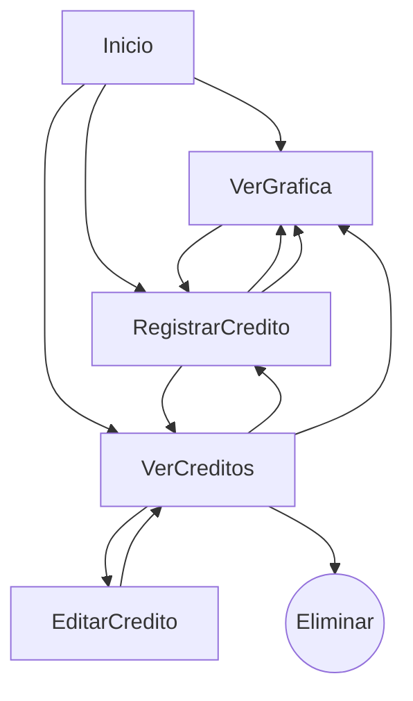

# Aplicación Flask para Registro de Créditos

**Examen Práctico: Desarrollo de una Herramienta de Registro de Créditos**

Realizado por: ***Luis Fernando Bautista Alcozer***

## Instrucciones para ejecutar el proyecto

El proyecto utiliza una base de datos SQLite ubicada en (`Database/creditos.db`), la cual ya está incluida en el repositorio. En caso de que no exista, puede generarse automáticamente ejecutando el script `init_db.py`.


### Paso 1. Clonar el repositorio
Ejecuta el siguiente comando en una terminal para clonar el repositorio:
```bash
git clone https://github.com/FerFerFer35/RegistroCreditos.git
```

### Paso 2. Acceder al directorio del proyecto
Ingresa al directorio recién clonado:
```bash
cd RegistroCreditos
```

### Paso 3. Instalar pipenv
Si aún no tienes pipenv instalado, ejecútalo con:
```bash
py -m pip install pipenv
```
Si ya tienes pipenv, puedes omitir este paso.

### Paso 4. Instalar las dependencias del proyecto
Ejecuta el siguiente comando para instalar todas las dependencias definidas en el entorno:
```bash
py -m pipenv install
```

### Paso 5. Activar el entorno virtual
Una vez instaladas las dependencias, activa el entorno con:
```bash
py -m pipenv shell
```

### Paso 6. Ejecutar la aplicación
Con el entorno virtual activo, lanza el servidor:
```bash
python app.py
```


### Secuencia de navegación del usuario
El siguiente diagrama representa el flujo general de interacción dentro del sistema. Muestra cómo el usuario puede navegar entre las diferentes secciones principales (como visualizar gráficas o registrar créditos), así como las acciones disponibles en cada vista, incluyendo operaciones como editar o eliminar un crédito existente. Este flujo ayuda a comprender la lógica de navegación y las relaciones entre componentes clave del sitio.



### Consideraciones del desarrollador
Quisiera agradecer a la empresa por haberme considerado como candidato para el puesto. Para mí fue una experiencia valiosa realizar esta pequeña prueba técnica, ya que implicó aprender a trabajar con un nuevo framework como Flask. Anteriormente había trabajado con Laravel y Spring, por lo que la adaptación fue rápida.

En cuanto a la estructura, el estilo y el comportamiento del sitio, ya contaba con experiencia utilizando HTML, CSS y JavaScript. Lo nuevo que aprendí en este ejercicio fue cómo integrar esos elementos con Flask. Previamente utilizaba librerías como React, donde gestionaba estados para enviar y recibir datos desde una API, por lo que este enfoque fue una buena oportunidad para ampliar mis conocimientos.

Espero haber cumplido con todos los requerimientos. Dentro del proyecto incluí varios comentarios que reflejan mi estilo de trabajo; los utilizo como guía y notas personales para organizar y completar cada parte del desarrollo.

Asimismo, considero este proyecto como un ejercicio de investigación y desarrollo, por lo que incluí referencias que me permitieron comprender mejor ciertos conceptos y completar adecuadamente el trabajo.


### Referencias
- <https://www.w3schools.com/ai/ai_chartjs.asp>
- <https://www.chartjs.org/docs/latest/>
- <https://flask.palletsprojects.com/en/stable/>
- <https://jinja.palletsprojects.com/en/stable/>
- <https://youtu.be/E2hytuQvLlE?si=WtSf--yEkDiEAIw7>
- <https://youtu.be/V9VU1g4IWlg?si=BLAvUqiTleqAfB5j>
